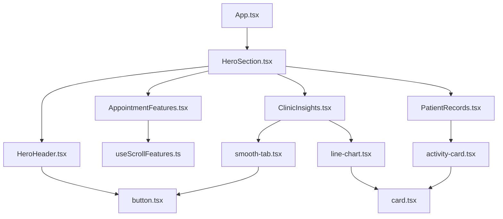

# Healthcare Dashboard - Product Requirements Document (PRD)

## 📋 Project Overview
A modern healthcare management system with interactive features, sticky scroll navigation, and comprehensive patient management tools.

## 🏗️ File Structure & Implementation

### 📁 Core Application Files
```
frontend/
├── src/
│   ├── App.tsx                           ✅ Main application component
│   ├── index.css                         ✅ Global styles and Tailwind CSS
│   ├── lib/
│   │   └── utils.ts                      ✅ Utility functions (cn, etc.)
│   │
│   ├── components/
│   │   ├── logo.tsx                      ✅ Brand logo component
│   │   │
│   │   ├── ui/                          # Reusable UI Components
│   │   │   ├── button.tsx               ✅ Button component with variants
│   │   │   ├── badge.tsx                ✅ Badge component for status indicators
│   │   │   ├── card.tsx                 ✅ Card components (Card, CardHeader, CardContent)
│   │   │   ├── progress.tsx             ✅ Progress bar component
│   │   │   ├── smooth-tab.tsx           ✅ Animated tab component with smooth indicator
│   │   │   ├── activity-card.tsx        ✅ Apple-style activity rings component
│   │   │   └── line-chart.tsx           ✅ Custom line chart for healthcare data
│   │   │
│   │   ├── hero-section/               # Landing Page Components
│   │   │   ├── HeroHeader.tsx          ✅ Navigation with theme toggle
│   │   │   └── HeroSection.tsx         ✅ Main hero section with CTA
│   │   │
│   │   ├── features/                   # Feature Components
│   │   │   ├── AppointmentFeatures.tsx ✅ Sticky scroll appointment features
│   │   │   ├── ClinicInsights.tsx      ✅ Analytics dashboard with tabs & charts
│   │   │   └── PatientRecords.tsx      ✅ Interactive patient health tracking
│   │   │
│   │   └── motion-primitives/          # Animation Components
│   │       ├── text-effect.tsx         ✅ Text animation effects
│   │       └── animated-group.tsx      ✅ Group animation wrapper
│   │
│   └── hooks/                          # Custom React Hooks
│       ├── useScrollFeatures.ts        ✅ Sticky scroll navigation logic
│       └── useTouchGestures.ts         ✅ Touch gesture handling
│
├── tsconfig.json                       ✅ TypeScript configuration
├── tsconfig.app.json                   ✅ App-specific TypeScript config
├── tsconfig.node.json                  ✅ Node-specific TypeScript config
├── vite.config.ts                      ✅ Vite build configuration
└── README.md                           ✅ Project documentation
```

## 🎯 Implemented Features

### 1. **Navigation & Theme System**
- **File**: `src/components/hero-section/HeroHeader.tsx`
- **Features**:
  - ✅ Responsive navigation menu
  - ✅ Dark/Light theme toggle with localStorage persistence
  - ✅ Smooth animations and transitions
  - ✅ Mobile hamburger menu

### 2. **Sticky Scroll Features**
- **File**: `src/components/features/AppointmentFeatures.tsx`
- **Hook**: `src/hooks/useScrollFeatures.ts`
- **Features**:
  - ✅ Sticky section behavior on scroll
  - ✅ Arrow navigation (Previous/Next)
  - ✅ Click navigation on feature list
  - ✅ Synchronized state management
  - ✅ Progress indicator
  - ✅ Responsive design (desktop/mobile)

### 3. **Interactive Analytics Dashboard**
- **File**: `src/components/features/ClinicInsights.tsx`
- **Components Used**:
  - `src/components/ui/smooth-tab.tsx` - Animated tabs
  - `src/components/ui/line-chart.tsx` - Custom charts
- **Features**:
  - ✅ Smooth animated tabs with sliding indicator
  - ✅ Interactive line charts with healthcare data
  - ✅ Revenue, Patient, and Performance metrics
  - ✅ Real-time data visualization

### 4. **Patient Health Tracking**
- **File**: `src/components/features/PatientRecords.tsx`
- **Features**:
  - ✅ Interactive health metrics selection
  - ✅ Dynamic chart updates based on selected metric
  - ✅ Blood pressure, heart rate, temperature tracking
  - ✅ Trend indicators with percentage changes
  - ✅ Professional medical interface

### 5. **UI Component Library**
- **Badge System**: Status indicators with variants
- **Card Components**: Flexible card layouts
- **Button System**: Multiple variants and sizes
- **Progress Bars**: For data visualization
- **Activity Cards**: Apple-style progress rings

## 🔧 Technical Implementation

### **State Management**
- React hooks for local state
- Custom hooks for complex logic (scroll, gestures)
- Shared state synchronization across components

### **Styling System**
- Tailwind CSS for utility-first styling
- CSS custom properties for theming
- Responsive design with mobile-first approach
- Dark/Light mode support

### **Animation & Interactions**
- Framer Motion for complex animations
- CSS transitions for smooth interactions
- Custom scroll-based animations
- Touch gesture support

### **TypeScript Integration**
- Full TypeScript support
- Type-safe component props
- Interface definitions for data structures
- Strict type checking enabled

## 📱 Responsive Design

### **Desktop (lg+)**
- Side-by-side layouts
- Full navigation menu
- Expanded feature displays
- Multi-column grids

### **Tablet (md)**
- Stacked layouts
- Condensed navigation
- Adapted spacing
- Touch-friendly interactions

### **Mobile (sm)**
- Single column layouts
- Hamburger menu
- Optimized touch targets
- Simplified interfaces

## 🎨 Design System

### **Colors**
- Primary: Blue (#3b82f6)
- Secondary: Various healthcare-appropriate colors
- Success: Green (#10b981)
- Warning: Amber (#f59e0b)
- Error: Red (#ef4444)

### **Typography**
- Headings: Bold, hierarchical sizing
- Body: Readable, accessible contrast
- Labels: Muted, informative

### **Spacing**
- Consistent spacing scale
- Responsive padding/margins
- Proper visual hierarchy

## 🚀 Performance Optimizations

### **Code Splitting**
- Component-based code splitting
- Lazy loading for heavy components
- Optimized bundle sizes

### **Asset Optimization**
- Image optimization
- SVG icons for scalability
- Efficient CSS delivery

### **Runtime Performance**
- Efficient re-renders with React hooks
- Memoization where appropriate
- Smooth 60fps animations

## 🔄 Future Enhancements

### **Planned Features**
- [ ] Real-time data integration
- [ ] Advanced filtering and search
- [ ] Export functionality
- [ ] Multi-language support
- [ ] Accessibility improvements
- [ ] PWA capabilities

### **Technical Debt**
- [ ] Add comprehensive testing
- [ ] Implement error boundaries
- [ ] Add loading states
- [ ] Optimize for SEO
- [ ] Add analytics tracking

## 📊 Component Dependencies



## 🎯 Success Metrics

### **User Experience**
- ✅ Smooth 60fps animations
- ✅ Responsive across all devices
- ✅ Intuitive navigation patterns
- ✅ Accessible design principles

### **Technical Performance**
- ✅ Fast initial load times
- ✅ Efficient state management
- ✅ Clean, maintainable code
- ✅ Type-safe implementation

### **Feature Completeness**
- ✅ Sticky scroll navigation
- ✅ Interactive data visualization
- ✅ Theme persistence
- ✅ Mobile-responsive design

---

**Last Updated**: Current Implementation
**Status**: ✅ Core Features Complete
**Next Phase**: Real-time data integration & testing